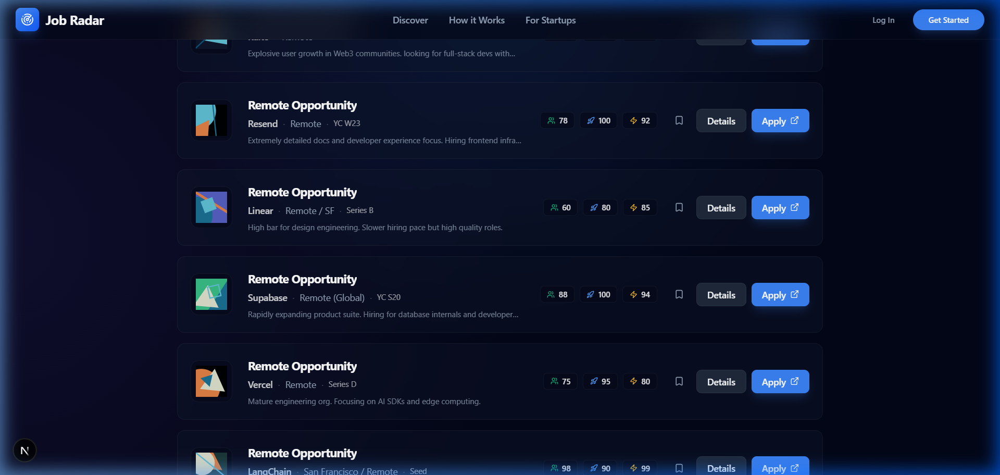
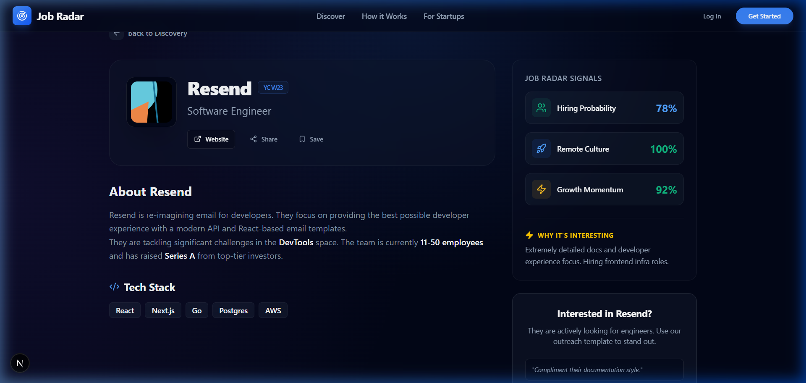

# 📡 Job Radar

> **Cut the noise. Find your next great startup job.**

Job Radar is a smart, curated job discovery platform built for developers who want *quality over quantity*. Instead of scrolling through bloated job boards full of outdated listings, Job Radar aggregates niche sources, applies AI scoring, and surfaces the best startup opportunities—fresh, filtered, and ready to act on.

---

## 🎯 The Vision

Traditional job boards are broken. They're full of ghost postings, irrelevant listings, and companies that haven't hired in months. Job Radar's mission is simple:

- ✅ Aggregate from **developer-focused, niche sources**
- ✅ Apply **AI scoring** to rank each opportunity by what matters to you
- ✅ Surface the **freshest leads** in a beautiful, easy-to-use interface

---

## ✅ What We've Built So Far

### 🤖 Data Ingestion Pipeline
- Abstract `BaseScraper` class for a standardized, extensible scraping architecture
- Active scrapers pulling real-time jobs from:
  - **HN Hiring** (`hnhiring.com/locations/remote`)
  - **Reddit** (`r/hiring`, `r/forhire`, `r/JobPostings`)
  - **Lets-Code**
- Initial keyword filtering to return only high-quality dev leads

### 🧠 AI-Powered Analysis (Gemini API)
Each job gets analyzed and scored across three dimensions:
| Score | What it means |
|---|---|
| 🔥 `hiringScore` | How urgently is this company hiring? |
| 🌍 `remoteScore` | How remote-friendly is this role? |
| 💻 `techStackScore` | How well does their stack match modern dev skills? |

Plus a human-readable `aiSummary` and an `outreachAngle` to give you a head start on your application.

### 🖥️ Modern Discovery UI
- Full-text **search** with server-side filtering
- **Pagination** for smooth navigation
- "**New**" badge for jobs updated within the last 24 hours
- "**Apply Now**" button with direct links to job applications
- Source filtering and sorting by freshness

### 🗄️ Optimized Data Layer
- Migrated to **SQLite** for frictionless local development
- Flexible DB config in `app.module.ts` to support future cloud DB providers

---

## 🛠️ Tech Stack

### Frontend
| Tech | Role |
|---|---|
| **Next.js** (React) | UI Framework |
| **TypeScript** | Type Safety |
| **Tailwind CSS** | Styling |

### Backend
| Tech | Role |
|---|---|
| **NestJS** | Backend API Framework |
| **TypeScript** | Type Safety |
| **SQLite + TypeORM** | Database & ORM |
| **Gemini API** (via `axios`) | AI Scoring & Summaries |

### Core Data Flow
```
[Scraper Sources]
  HN Hiring, Reddit, Lets-Code
       │
       ▼
[IngestionService]
  Fetches & keyword-filters raw posts
       │
       ▼
[AiModule (Gemini)]
  Scores, summarizes & adds outreach angles
       │
       ▼
[SQLite Database]
  Stores enriched job records
       │
       ▼
[Next.js Frontend]
  Search, filter, sort & display jobs
```

### 🕸️ Autonomous Scraper Engine
To maintain a high-quality, fresh pipeline of leads, the NestJS backend operates a dedicated **Ingestion Engine**:
1. **Source Adapters**: Custom scraper classes use `axios` and `cheerio` to extract raw HTML from dynamic sources like the *Hacker News "Who is hiring"* threads and various Reddit communities.
2. **Regex Sanitation**: Raw strings are aggressively parsed using Regex to isolate real company names and clean descriptions from forum artifacts (like usernames and timestamps).
3. **Async Upstream**: The ingestion process runs asynchronously. The frontend can trigger a refresh via `/ingestion/trigger` (returning a `202 Accepted`) while the backend safely processes and scores hundreds of leads in the background without causing HTTP timeouts.

```

---

## 📸 Gallery

### 1. Discovery Feed
A dense, recruiter-friendly horizontal layout inspired by top-tier professional tools, featuring AI-generated hiring, remote, and growth scores.



### 2. Startup Deep Dive
Clean, focused details page prioritizing data-density, AI outreach angles, and immediate conversion (Apply Now).



---

## 🚀 Deployment Strategy

For recruiters to view this project live:
1. **Database Migration**: Switch from local SQLite to a serverless PostgreSQL instance (e.g., Supabase or Neon DB).
2. **Backend (NestJS)**: Deploy to **Render** or **Railway** (free tiers) to support the long-running web scraping workers. Ensure `GEMINI_API_KEY` is set in the environment variables.
3. **Frontend (Next.js)**: Deploy to **Vercel** for optimal Edge Network caching and global performance, linking the `NEXT_PUBLIC_API_URL` to the live backend URL.

---

## 🗺️ Roadmap & Completed Features

We are actively checking features off the roadmap. Here is what has been accomplished and what's next:

### ✅ Completed
- [x] 🔘 **One-click "Refresh Jobs"** — Interactive UI button that triggers an asynchronous backend scrape.
- [x] 🔗 **Direct Application Links** — Detailed scraper logic to pull direct Careers/ATS URLs instead of generic homepages.
- [x] 🌍 **Global / India Remote Filtration** — Dedicated UI toggle to find non-US remote opportunities.
- [x] 🤖 **AI Outreach Angles** — Automated generation of personalized cold-outreach templates for founders.

### 🔜 Coming Next
- [ ] 🔎 **Advanced Filters** — filter by specific industries, experience levels, and specific tech stacks.
- [ ] 🌐 **More Scraper Sources** — research and add scraping for Greenhouse/Lever direct feeds.
- [ ] 🏢 **Company Logos Automation** — implement Clearbit or Brandfetch APIs to automatically pull rich company logos.
- [ ] ⚡ **Incremental Updates & Caching** — keep the DB fresh without full re-ingestion cycles.

---

## 🚀 Getting Started

### 1. Backend
```bash
cd backend
npm install
npm run start:dev
```

### 2. Frontend
```bash
cd frontend
npm install
npm run dev
```

Open [http://localhost:3000](http://localhost:3000) in your browser!

---

*Built with ❤️ to make the job hunt a little less painful.*
